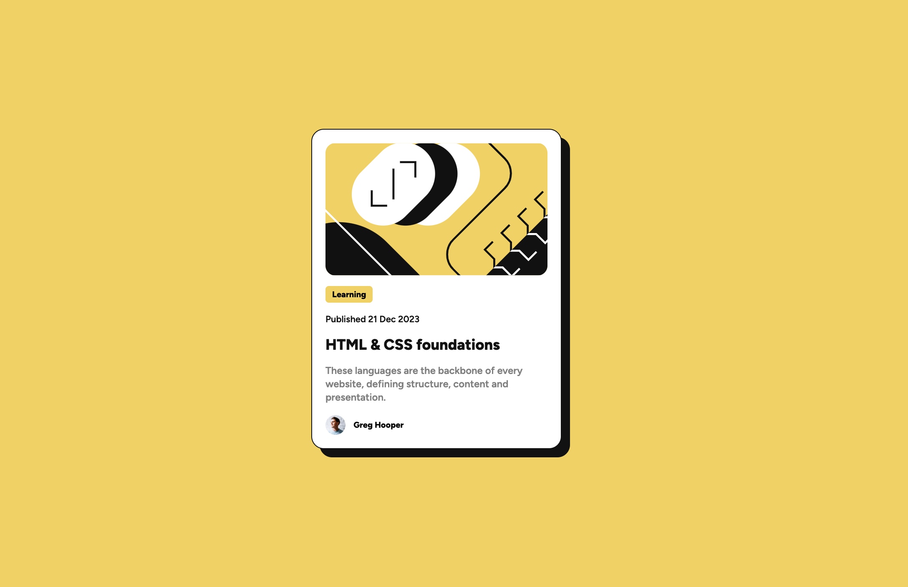
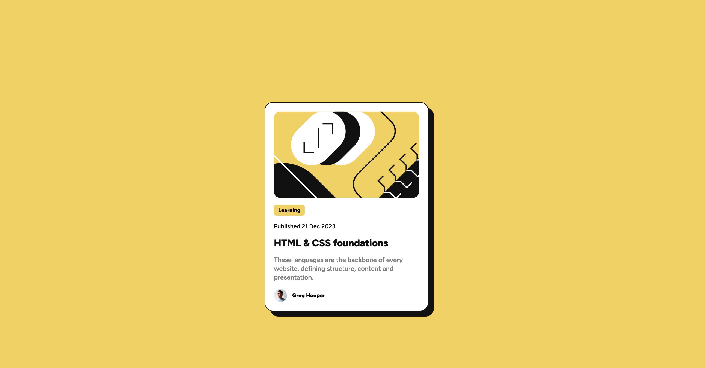
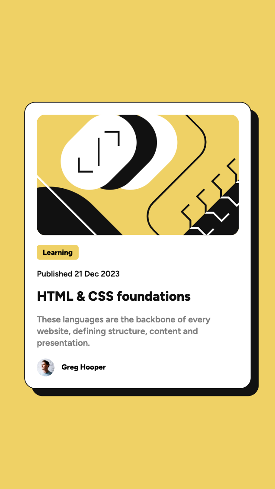

# Frontend Mentor - Blog preview card

## The challenge

Your users should be able to:

- See hover and focus states for all interactive elements on the page

### Screenshot

### Links

- Solution URL: [Add solution URL here](https://your-solution-url.com)
- Live Site URL:

## My process

### Built with

- HTML
- CSS
- Flexbox

### What I learned

From this challenge I gained more experience in creating webpages based on pre-made designs. Using Flexbox for the challange helped me gain a better understanding of its use for laying out items within a webpage. This layout model is also useful for making a layout responsive without needing many media queries.
